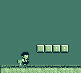
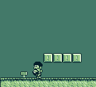

# Reference Toolchain Comparison — REQ-1 Diagnostic Verdict

## Verdict

**Branch: `gbkt-misconfig`**

The unmodified GBDK-2020 reference platformer example renders the player duck sprite as a
recognizable 24×32 character (head, body, and legs clearly visible) when loaded in Coffee-GB.
The gbkt port's post-12.4-15 ROM renders the same player sprite as a tiny malformed blob of
approximately 2–4 pixels in the center of the screen.

The diagnostic conclusion is unambiguous: the reference toolchain works correctly. The bug is
entirely on gbkt's side. The root cause is that `ConvertSpritesTask.convertSprite()` passes
zero of the png2asset cutting flags (`-px`, `-py`, `-spr8x16`, `-sw`, `-sh`) documented in
the reference Makefile and in `gbkt-examples/platformer-template/res/README.md`. Without these
flags, png2asset uses its default whole-image slicing, producing a 2col×3row layout (16×48 px
with an 8-pixel column gap) instead of the correct 3col×2row layout (24×32 px). The gbkt
codegen reproduces png2asset's flawed output byte-for-byte — it is not a MetaspriteVisitor
bug, it is a missing-flags-at-invocation bug.

Phase 12.5 proceeds on the **`gbkt-misconfig`** branch: the DSL flag-exposure refactor
(Plans 02–06), 7-game migration (Plans 07–08), visual re-shoot (Plan 09), Phase 12.3 closure
(Plan 10), and WR-01/02/03 cleanups (Plans 11–13) all execute as specified in CONTEXT.md D-04..D-13.
The `branch=png2asset-upstream-bug` escalation path (D-03) is NOT activated.

## Reference Toolchain Flag Set

Extracted verbatim from `/Users/michalsvacha/gbdk/examples/cross-platform/platformer_template/Makefile`
line 81 (reformatted for readability):

```makefile
$(PNG2ASSET) res/graphics/player-character-$(SPRITES)-sprites.png \
    -c $(GENDIR)/PlayerCharacterSprites.c \
    -px 12 -py 6 -spr8x16 -keep_palette_order -sw 24 -sh 32 \
    $(PNG2ASSET_SPRITE_SETTINGS_$(EXT)) -b 255
```

For the GB target, `PNG2ASSET_SPRITE_SETTINGS_gb` is empty (confirmed in `Makefile.targets`),
so the **effective flag set for the GB target** is:

```
-px 12 -py 6 -spr8x16 -keep_palette_order -sw 24 -sh 32 -b 255
```

**Flag annotations:**

| Flag | Value | Meaning |
|------|-------|---------|
| `-px` | 12 | Pivot X offset (anchor point within the metasprite frame) |
| `-py` | 6 | Pivot Y offset (anchor point within the metasprite frame) |
| `-spr8x16` | (present) | Use 8×16 hardware sprite mode (2 OBJ tiles stacked vertically per slot) |
| `-keep_palette_order` | (present) | Preserve palette ordering as declared in the PNG |
| `-sw` | 24 | Frame slice width in pixels (3 columns × 8 px = 24 px) |
| `-sh` | 32 | Frame slice height in pixels (2 rows × 16 px = 32 px) |
| `-b` | 255 | Bank number for BANKREF symbol (255 = "not banked" sentinel) |

**Notes on differences from the Phase 12.4-08 evidence run:**

- `-keep_palette_order` is present in the reference Makefile but was NOT included in the
  Plan 12.4-08 evidence run (run via direct `png2asset` invocation with manual flags). It
  does not affect the metasprite layout; it controls tile-palette ordering only.
- `-b 255` sets the BANKREF linker symbol. In gbkt's pipeline, `ConvertSpritesTask` injects
  `#pragma bank 1` via post-processing, which supersedes the `-b N` flag. The `-b 255`
  value in the reference ROM simply uses a sentinel meaning "not explicitly banked" — not
  meaningful in gbkt's context.
- The **layout-critical flags** are `-px 12 -py 6 -spr8x16 -sw 24 -sh 32`. These 5 flags
  are entirely absent from `ConvertSpritesTask`'s current png2asset invocation. This is
  the confirmed root cause of the 2col×3row vs 3col×2row layout disagreement.

## Side-by-Side Comparison

### Reference GBDK toolchain output (Coffee-GB, frame 290 facing right / frame 305 facing left)


*Reference ROM — duck facing right: recognizable 24×32 duck character (head, body, legs visible)*


*Reference ROM — duck facing left: horizontally flipped, clearly recognizable*

### Post-12.4-15 gbkt ROM output (the broken baseline)


*gbkt post-12.4-15 — walk frame 0: tiny dark pixel blob, NOT recognizable as a duck*


*gbkt post-12.4-15 — facing left: same tiny blob, slightly different position — both frames are broken*

**Visual assessment summary:**

- Reference ROM: Duck is a large, clearly recognizable character sprite (~24 px wide, ~32 px tall
  on screen). Walking animation works; left-facing flip is visible (character faces opposite direction).
- gbkt post-12.4-15: A 2–4 pixel dark blob appears in the upper-center area of the screen. No
  duck anatomy visible. The 7.47% pixel-diff between the two broken frames (Phase 12.4-15 verdict)
  was spurious noise between two malformed renderings.

## Smoking Gun

`ConvertSpritesTask.kt:235-244` — the png2asset invocation site — currently passes only two
flags (`-spr8x8` from the height heuristic, and `-noflip` from `mirrorDedup`). None of the
five cutting flags are present:

```kotlin
// ConvertSpritesTask.kt:235-244 (current, Phase 12.4 state)
val spriteMode = spriteModeFromHeight(pngFile)  // height heuristic — SPR8x16 for tall PNGs

val args = mutableListOf(pngFile.absolutePath, "-o", outputC.absolutePath)
when (spriteMode) {
    SpriteMode.SPR8x8 -> args.add("-spr8x8")
    SpriteMode.SPR8x16 -> {
        /* default, no flag needed */
    }
}

// mirrorDedup=false → add -noflip
if (!mirrorDedup) {
    args.add("-noflip")
}
```

**Absent flags (root cause):** `-px 12`, `-py 6`, `-sw 24`, `-sh 32` are never added to `args`.
The height heuristic (`spriteModeFromHeight`) returns `SPR8x16` for the 64px-tall player PNG,
so the implicit default SPR8x16 mode is used — but without the pivot and frame-size flags, png2asset
uses a default frame origin of (0,0) and frame size equal to the full PNG width/height divided by
the sprite dimension. This produces the wrong 2col×3row layout instead of the correct 3col×2row
layout.

Phase 12.5 Plans 02–06 replace the height-heuristic-driven invocation with a sidecar-driven
flag builder that passes all 5 cutting flags from the DSL declaration. The `spriteModeFromHeight()`
function at lines 434–452 is deleted as dead code once all 7 games migrate (Plans 07–08).

## Escalation Plan (if branch=png2asset-upstream-bug)

Not applicable on the `gbkt-misconfig` branch.

The reference GBDK toolchain renders the duck correctly, confirming that png2asset itself
works correctly when given the right flags. There is no upstream png2asset bug. No GitHub
issue filing needed. No `SEED-PHASE-12-PNG2ASSET-UPSTREAM-BUG.md` needed.

Phase 12.5 proceeds with the full DSL flag-exposure refactor as specified in CONTEXT.md D-04..D-13.
