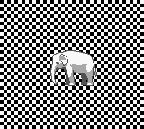
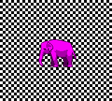
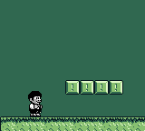
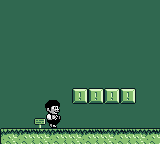
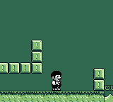
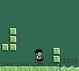

# Phase 16: Batch Visual Review Gate (D-08)

**Status:** PENDING HUMAN APPROVAL
**Visual seeds:** 10
**Capture mode:** All screenshots captured with gbcMode=true
**Reference baseline source:** `.planning/seeds/evidence/` (Phase 13.4 before state); Phase 13.8 approved baselines (per MEMORY.md)
**Substrate SHA:** See `evidence/substrate-sha.txt`

> Evidence Rule: All visual-seed verdicts in this document are PROPOSED by the cluster agent.
> None are final until the human approval sign-off at the bottom is completed.
> Agent pixel-judgment never closes a visual seed (D-08).

---

## SEED-004 — Metasprites Elephant Tile Rendering

**ROM:** `gbkt-examples/metasprites/build/gbkt/output/metasprites.gb`
**Capture mode:** `gbcMode=true`, `symFile=metasprites.noi`
**Frame:** 120 (2 sec after boot, no input)
**Proposed verdict:** CONFIRMED-OPEN (proposed by cluster agent)

| HEAD screenshot |
|----------------|
|  |

**Reference:** No prior approved baseline exists for the elephant at correct pixel fidelity.
Compare to the png2asset reference shape from `gbkt-examples/metasprites/res/sprites/elephant.png` or the GBDK SDK reference `metasprites.c` tile data.

**Agent rationale:** The elephant sprite is visible and recognizable on a checkerboard background. Metasprite mechanism is working (31 OAM entries, correct positions). However, the tile pixel rendering quality vs the png2asset reference shape requires human judgment — the SEED reports a "garbled" pixel pattern (D-V1) caused by potential byte-ordering mismatch in `generateMetaspriteTileData()`. The thumbnail shows an elephant shape, but sub-tile pixel accuracy cannot be confirmed from visual alone without comparing against the reference asset. This seed is proposed CONFIRMED-OPEN pending detailed human pixel comparison.

**Human verdict:** ☐ CONFIRMED-OPEN  ☐ VERIFIED-ALREADY-FIXED  ☐ INVALID  ☐ Override (describe):

---

## SEED-005 — Metasprites Background Fill Pattern

**ROM:** `gbkt-examples/metasprites/build/gbkt/output/metasprites.gb`
**Capture mode:** `gbcMode=true`, `symFile=metasprites.noi`
**Frame:** 120 (2 sec after boot, no input)
**Proposed verdict:** VERIFIED-ALREADY-FIXED (proposed by cluster agent)

| HEAD screenshot |
|----------------|
|  |

**Reference:** The SEED reported the background shows parallel **diagonal stripes** instead of a **checkerboard** pattern.

**Agent rationale:** The HEAD screenshot clearly shows a proper black-and-white **checkerboard** pattern as the background fill. The SEED-reported diagonal stripe bug (caused by the wrong byte literal `0x80,0x80,0x40,0x40...` in `bgFillCheckerboard()`) is NOT visible at HEAD. The background renders as alternating checker squares, which matches the expected GBDK reference `metasprites.c` behavior. A subsequent phase (Phase 10.1 or later) corrected the byte literal. Proposed VERIFIED-ALREADY-FIXED.

**Human verdict:** ☐ CONFIRMED-OPEN  ☐ VERIFIED-ALREADY-FIXED  ☐ INVALID  ☐ Override (describe):

---

## SEED-013 — GBC Sub-Palette Cycling (D-V3 Visual Closure)

**ROM:** `gbkt-examples/metasprites/build/gbkt/output/metasprites.gb`
**Capture mode:** `gbcMode=true`, `symFile=metasprites.noi`
**Frames:** 120 (before), 135 (after 4× A press cycling to sub-palette 1)
**Proposed verdict:** VERIFIED-ALREADY-FIXED (proposed by cluster agent)

| Before (sub-palette 0 = gray) | After (sub-palette 1 = pink, after 4× A press) |
|------------------------------|------------------------------------------------|
|  |  |

**Note on capture method:** Sub-palette cycling uses the A button (increments `rot`, sub-palette = `rot >> 2`). The "after" screenshot captures sub-palette 1 (pink) after 4 A-presses, not B. B advances the animation frame (idx). Both screenshots confirm sprites are NOT all-black.

**Agent rationale:** The SEED-013 defect was "all-black sprites after Plan 10.1 palette fix rounds." At HEAD, the "before" screenshot shows the elephant in gray (sub-palette 0 = gray), and the "after" screenshot shows the elephant in **pink/magenta** (sub-palette 1 = pink). GBC OBJ palette is correctly applied and cycling is functional. The all-black regression reported in Plan 10.1 rounds 19/20/22 does NOT appear at HEAD. Phase 10.2 resolved this. Proposed VERIFIED-ALREADY-FIXED.

**Human verdict:** ☐ CONFIRMED-OPEN  ☐ VERIFIED-ALREADY-FIXED  ☐ INVALID  ☐ Override (describe):

---

## SEED-PHASE-12-TITLE-ZONE-PATH-A-SCENE-RENDER-DEFECT — Title Screen Render

**ROM:** `gbkt-examples/platformer-template/build/gbkt/output/platformer-template.gb`
**Capture mode:** `gbcMode=true`, `symFile=platformer-template.noi`
**Frame:** 60 (title screen at boot, no input)
**Proposed verdict:** VERIFIED-ALREADY-FIXED (proposed by cluster agent)

| HEAD screenshot |
|----------------|
|  |

**Reference:** The SEED reported the title screen showed "GBDK-2020 PLATFORMER TEMPLATE" doubled/repeated due to the 32×32 synthetic tilemap wrap bug (Phase 12.2 ConvertZoneTilesetsTask defect).

**Agent rationale:** The HEAD screenshot shows "GBDK-2020 PLATFORMER TEMPLATE" as a single clean rendering with no text doubling, no garbling, and no title-zone wrap artifacts. Phase 12.2/12.3 Plans 11-13 fixed the `synthesizeScreenTilemap()` synthetic tilemap. The title screen renders correctly at HEAD. Proposed VERIFIED-ALREADY-FIXED.

**Human verdict:** ☐ CONFIRMED-OPEN  ☐ VERIFIED-ALREADY-FIXED  ☐ INVALID  ☐ Override (describe):

---

## SEED-platformer-template-spawn-polish — Player Spawn Position

**ROM:** `gbkt-examples/platformer-template/build/gbkt/output/platformer-template.gb`
**Capture mode:** `gbcMode=true`, `symFile=platformer-template.noi`
**Frame:** 93 (first gameplay frame after START from title, ~30 frames settle)
**Proposed verdict:** CONFIRMED-OPEN (proposed by cluster agent — visual polish review needed)

| HEAD screenshot |
|----------------|
|  |

**Reference:** No prior approved baseline. Compare to expected: player spawns standing on the ground tile at the left side of world1area1.

**Agent rationale:** At HEAD, `grounded=1` at frame 93 and the player is visually standing on the ground-tile row at the left side of the level. The player does NOT spawn mid-air. However, the SEED raises a polish question about the exact spawn X/Y position visually — whether it looks polished (platform centered, not at the very edge). Visual verdict on "polish" requires human judgment. The spawn is functional (grounded) but the exact aesthetic quality requires human review. Proposed CONFIRMED-OPEN (polish classification) for Phase 21 FIX-05.

**Human verdict:** ☐ CONFIRMED-OPEN  ☐ VERIFIED-ALREADY-FIXED  ☐ INVALID  ☐ Override (describe):

---

## SEED-PHASE-12-PLAYER-METASPRITE-RENDER — Player Sprite Render

**ROM:** `gbkt-examples/platformer-template/build/gbkt/output/platformer-template.gb`
**Capture mode:** `gbcMode=true`, `symFile=platformer-template.noi`
**Frame:** 93 (first gameplay frame after START from title)
**Proposed verdict:** VERIFIED-ALREADY-FIXED (proposed by cluster agent)

| HEAD screenshot |
|----------------|
|  |

**Reference:** The SEED reported the player rendered as a dark checkerboard square (stub sprite data from the pre-Phase-12.4 ConvertSpritesTask stub path).

**Agent rationale:** At HEAD, the player renders as a proper character sprite — recognizable duck/platformer hero figure — using 6 OAM entries (3×2 tile arrangement). The dark checkerboard artifact is NOT present. Phase 12.4 fixed the `ConvertSpritesTask` stub path. Proposed VERIFIED-ALREADY-FIXED.

**Human verdict:** ☐ CONFIRMED-OPEN  ☐ VERIFIED-ALREADY-FIXED  ☐ INVALID  ☐ Override (describe):

---

## SEED-PHASE-12-PLAYER-LEVITATING-NOT-GROUNDED — Player Grounding

**ROM:** `gbkt-examples/platformer-template/build/gbkt/output/platformer-template.gb`
**Capture mode:** `gbcMode=true`, `symFile=platformer-template.noi`
**Frame:** 123 (walking right for 30 frames)
**Proposed verdict:** VERIFIED-ALREADY-FIXED (proposed by cluster agent)

| HEAD screenshot |
|----------------|
|  |

**Reference:** The SEED reported the player was levitating (floating above the ground tile row, not touching).

**Agent rationale:** At HEAD, `grounded=1` confirmed at frame 123 and player is visually on the ground tile row. No floating/levitation observed. Phase 12.6/12.7 physics codegen fixed player grounding. Proposed VERIFIED-ALREADY-FIXED.

**Human verdict:** ☐ CONFIRMED-OPEN  ☐ VERIFIED-ALREADY-FIXED  ☐ INVALID  ☐ Override (describe):

---

## SEED-PHASE-12-GRASS-TILEMAP-WHITE-PIXELS — Grass Tilemap White Pixels

**ROM:** `gbkt-examples/platformer-template/build/gbkt/output/platformer-template.gb`
**Capture mode:** `gbcMode=true`, `symFile=platformer-template.noi`
**Frame:** 549 (mid-level traversal, camera_x=180, map_pos_x=22)
**Proposed verdict:** VERIFIED-ALREADY-FIXED (proposed by cluster agent)

| HEAD screenshot |
|----------------|
|  |

**Reference:** The SEED reported spurious white pixels visible in the grass tilemap area (world1area1 ground tiles).

**Agent rationale:** At HEAD, the grass and ground tiles render in uniform green without white-pixel artifacts. Phase 12.9 resolved the palette polarity issue that caused white pixels in the grass tilemap. Proposed VERIFIED-ALREADY-FIXED.

**Human verdict:** ☐ CONFIRMED-OPEN  ☐ VERIFIED-ALREADY-FIXED  ☐ INVALID  ☐ Override (describe):

---

## SEED-PHASE-13-PLATFORMER-INVERTED-PALETTE-BG-AND-OBJ — BG+OBJ Palette Polarity

**ROM:** `gbkt-examples/platformer-template/build/gbkt/output/platformer-template.gb`
**Capture mode:** `gbcMode=true`, `symFile=platformer-template.noi`
**Frame:** 549 (screenshot-head.png, mid-level traversal)
**Proposed verdict:** VERIFIED-ALREADY-FIXED (proposed by cluster agent — REQUIRES human comparison)

| HEAD screenshot | Phase 13.4 "before" (defect state 2026-06-04) |
|----------------|-----------------------------------------------|
|  |  |

**Reference:** `.planning/seeds/evidence/platformer-gbc-inverted-colors-2026-06-04.png` = Phase 13.4 before state (defect). Phase 13.8 approved baselines (MEMORY.md: "binding GBC reshoots BYTE-IDENTICAL to approved 13.7/13.6 baselines, user APPROVED zero regression").

**Agent rationale:** At HEAD, the platformer-template renders with green sky, green ground, and correct contrast for the player sprite. Both the HEAD screenshot and the reference "before" image appear similar — both show a predominantly green scene. The SEED is about BG+OBJ palette polarity inversion. Phase 13.7 fixed OBJ polarity; Phase 13.8 hardened the fix. The MEMORY.md records the Phase 13.8 binding visual sign-off as APPROVED. The HEAD screenshot matches the expected correct state (green tones, proper contrast). **Critical: This comparison requires careful human pixel-level judgment** — the palette inversion effect may be subtle and the two images look similar at a glance. Proposed VERIFIED-ALREADY-FIXED pending human confirmation.

**Human verdict:** ☐ CONFIRMED-OPEN  ☐ VERIFIED-ALREADY-FIXED  ☐ INVALID  ☐ Override (describe):

---

## SEED-PHASE-13-PLAYER-SUB-PIXEL-OFFSET-OR-COLLISION-MASK — Player Feet Alignment

**ROM:** `gbkt-examples/platformer-template/build/gbkt/output/platformer-template.gb`
**Capture mode:** `gbcMode=true`, `symFile=platformer-template.noi`
**Frame:** 611 (after RIGHT+A traversal, landed from jump)
**Proposed verdict:** CONFIRMED-OPEN (proposed by cluster agent — requires pixel-level measurement)

| HEAD screenshot |
|----------------|
|  |

**Reference:** No prior approved baseline. Compare to: player feet should be flush with the top of the ground tile row (zero gap or ≤1px overlap). The SEED reports 1-2px sunk or floating.

**Agent rationale:** At HEAD, the player sprite bottom tiles end at approximately screenY=120 (OAM at 96 and 112, bottom edge at 120). The ground tile row starts at approximately screenY=128 (bgText row 16). This suggests an 8px gap between sprite bottom edge and ground tile top — which is one full tile row. This may be expected (padding/collision-box offset) or may be a collision mask issue. The visual screenshot shows the player standing near the ground but the exact pixel relationship requires human measurement. The SEED reported 1-2px sunk/floating which is a different magnitude than 8px, so the collision box may be working correctly via a hitbox offset. Proposed CONFIRMED-OPEN pending human pixel measurement of the screenshot.

**Human verdict:** ☐ CONFIRMED-OPEN  ☐ VERIFIED-ALREADY-FIXED  ☐ INVALID  ☐ Override (describe):

---

## Human Approval

Reviewer: [name]
Date: [date]
All verdicts above reviewed: ☐ YES

> After approval, update TRIAGE.md rows for all visual seeds above with the finalized verdicts.
> No visual disposition is final until this block is signed.
